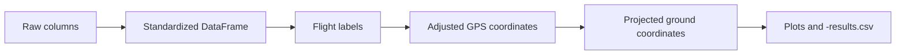

# Data Model

This page describes the raw input columns, the important format differences between CSV and XLSX files, and the processed output columns added by the notebook.

## Input File Types

The notebook supports:

- `.csv`
- `.xlsx`

Both file types represent the same overall sensor stream, but they differ in two important ways:

1. XLSX files can contain `Names of Flights` segment labels.
2. CSV `Elapsed` values may be damaged by Excel scientific notation export and need reconstruction from `Time`.

## Raw Input Columns

Common raw sensor columns used by the notebook:

| Column | Meaning | Used in |
| --- | --- | --- |
| `Elapsed` | Time-like field, sometimes valid and sometimes degraded in CSV | time normalization |
| `Date` | Recording date | provenance |
| `Time` | Clock or sensor-relative time | time normalization |
| `Pitch` | Aircraft pitch angle | ground geometry |
| `Roll` | Aircraft roll angle | ground geometry |
| `Heading` | Aircraft yaw/heading angle | ground geometry |
| `Latitude` | GPS latitude | drift correction, geometry |
| `Longitude` | GPS longitude | drift correction, geometry |
| `Altitude` | GPS altitude | flight detection, drift correction, ground altitude |
| `Velocity` | Velocity estimate | context only |
| `ALT:Altitude` | LIDAR range / height above ground | ground geometry |
| `GAS:Methane` | Methane measurement | visualization and outputs |
| `GAS:Status` | Gas sensor status | provenance |

Columns that may appear in some files:

| Column | Meaning |
| --- | --- |
| `Next WP` | waypoint information |
| `RTK Status` | RTK state |
| `Latitude RTK` | RTK latitude |
| `Longitude RTK` | RTK longitude |
| `Altitude RTK` | RTK altitude |
| `ALT:ID` | CSV-only altimeter identifier, dropped during standardized processing |

## CSV vs XLSX Differences

| File type | `Elapsed` | `Time` | `Names of Flights` |
| --- | --- | --- | --- |
| CSV | may be collapsed to one repeated scientific-notation value | often `MM:SS.s` | inserted by notebook |
| XLSX | usually usable epoch milliseconds | often `datetime.time` | often present in source |

## Processed Output Columns

The notebook keeps most original columns and adds these derived fields:

| Column | Meaning |
| --- | --- |
| `Flight` | detected flight membership, e.g. `Flight 1` or `On Ground` |
| `Names of Flights` | propagated segment label within a flight |
| `Latitude_adj` | drift-corrected latitude |
| `Longitude_adj` | drift-corrected longitude |
| `Altitude_adj` | drift-corrected altitude |
| `ground_lat` | projected laser ground latitude |
| `ground_lon` | projected laser ground longitude |
| `ground_alt_est` | estimated ground elevation from adjusted GPS altitude minus LIDAR height |
| `horizontal_offset_m` | horizontal displacement between drone position and ground impact point |

## Important Output Semantics

- `ground_*` fields are blank on `On Ground` rows.
- CSV unlabeled in-flight rows keep empty `Names of Flights`.
- `Flight` ranges use half-open intervals internally, so the first landing row is not labeled in-flight.

## Data Flow Figure

