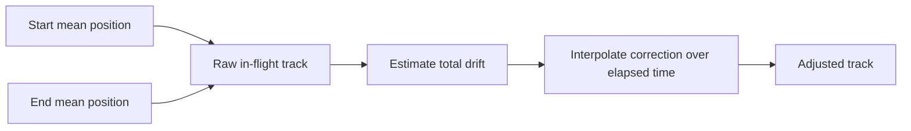

# Drift Correction

`correct_drift_per_flight()` applies a simple 3D linear drift model to the detected flight interval.

## Why Drift Correction Exists

The aircraft is assumed to take off and land at the same real-world location within a file. Raw GPS often drifts enough during a flight that the end coordinates no longer match the start coordinates. That drift contaminates:

- the reported drone track
- `ground_alt_est`
- the projected ground coordinates

## Method

For each flight:

1. Take the first `n_avg` valid GPS rows.
2. Take the last `n_avg` valid GPS rows.
3. Compute the mean start and end position in 3D.
4. Treat the difference as the drift vector.
5. Interpolate that correction linearly over elapsed time.

Outputs:

- `Latitude_adj`
- `Longitude_adj`
- `Altitude_adj`

## Concept Figure



## Pseudocode

```text
start_mean = mean(first n valid points)
end_mean = mean(last n valid points)
drift = end_mean - start_mean
frac = (elapsed - t0) / (tN - t0)
adjusted = raw - frac * drift
```
