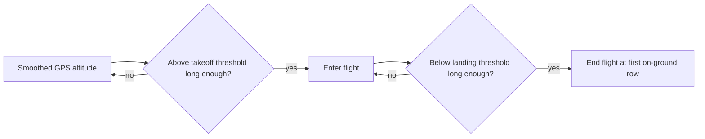

# Flight Detection

`detect_flights()` finds the airborne interval in each file using GPS altitude rather than LIDAR.

## Why GPS Altitude Is Used

LIDAR `ALT:Altitude` is not a reliable boundary signal because:

- it saturates at 250 m,
- it can return near-zero values when the beam is blocked,
- it is meant for height-above-ground, not flight-state classification.

GPS `Altitude` is the better signal for distinguishing ground from flight.

## Current Detector Logic

Configuration variables:

- `TAKEOFF_THRESHOLD_M = 0.75`
- `LANDING_THRESHOLD_M = 0.35`
- `ALTITUDE_SMOOTHING_WINDOW = 30`
- `MIN_TAKEOFF_RUN = 5`
- `MIN_LANDING_RUN = 5`

Algorithm:

1. Smooth `Altitude` with a centered rolling mean.
2. Start a flight after a sustained run above the takeoff threshold.
3. End a flight at the first sustained run below the landing threshold.
4. Store the flight as a half-open interval: `(start_row, end_row)`.

## Detector Diagram

## Interval Semantics

- `start_row` is in-flight
- `end_row` is the first on-ground row after landing
- labeling uses `start_row:end_row`

That keeps the landing row out of the in-flight span.
