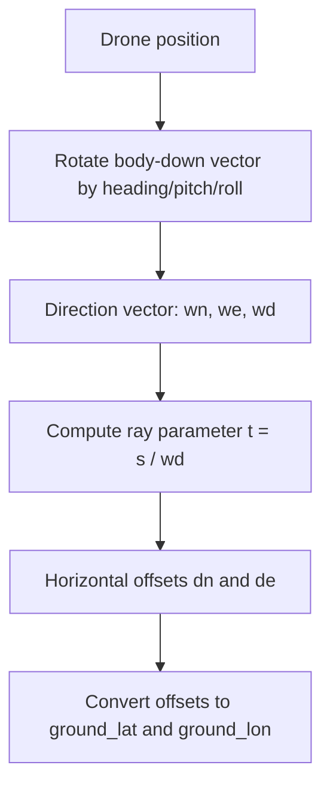

# Ground Coordinates and Trigonometry

This page explains how `compute_ground_coordinates()` turns drone pose and LIDAR range into a ground-intersection point.

## What the Function Uses

Inputs per row:

- `Latitude_adj` / `Longitude_adj` when available, otherwise raw coordinates
- `Altitude_adj` when available, otherwise raw altitude
- `Heading`
- `Pitch`
- `Roll`
- `ALT:Altitude`

## Core Idea

The LIDAR provides a downward range `s`.

The orientation angles rotate the body-frame down vector into a navigation frame with components:

```text
wn = north component
we = east component
wd = down component
```

The ray reaches the ground when:

```text
t = s / wd
```

Then the horizontal offsets are:

```text
dn = t * wn
de = t * we
```

Those north/east offsets are converted from meters into latitude/longitude offsets using WGS84 curvature terms.

## Geometry Diagram



## Worked Example

Suppose:

- `ALT:Altitude = 20.0 m`
- `Pitch = 10 deg`
- `Roll = 0 deg`
- `Heading = 0 deg`

Approximate directional components:

```text
wn ~= sin(10 deg) = 0.1736
we ~= 0
wd ~= cos(10 deg) = 0.9848
```

Then:

```text
t = 20.0 / 0.9848 = 20.31
dn = 20.31 * 0.1736 = 3.53 m
de = 0 m
```

Interpretation:

- the laser hits the ground about 3.5 m north of the drone
- the ray length is slightly longer than the vertical height because the beam is tilted

## On-Ground Policy

The current notebook does **not** emit `ground_*` values for `On Ground` rows. That prevents misleading pseudo-intersections when the aircraft is stationary on the ground.
