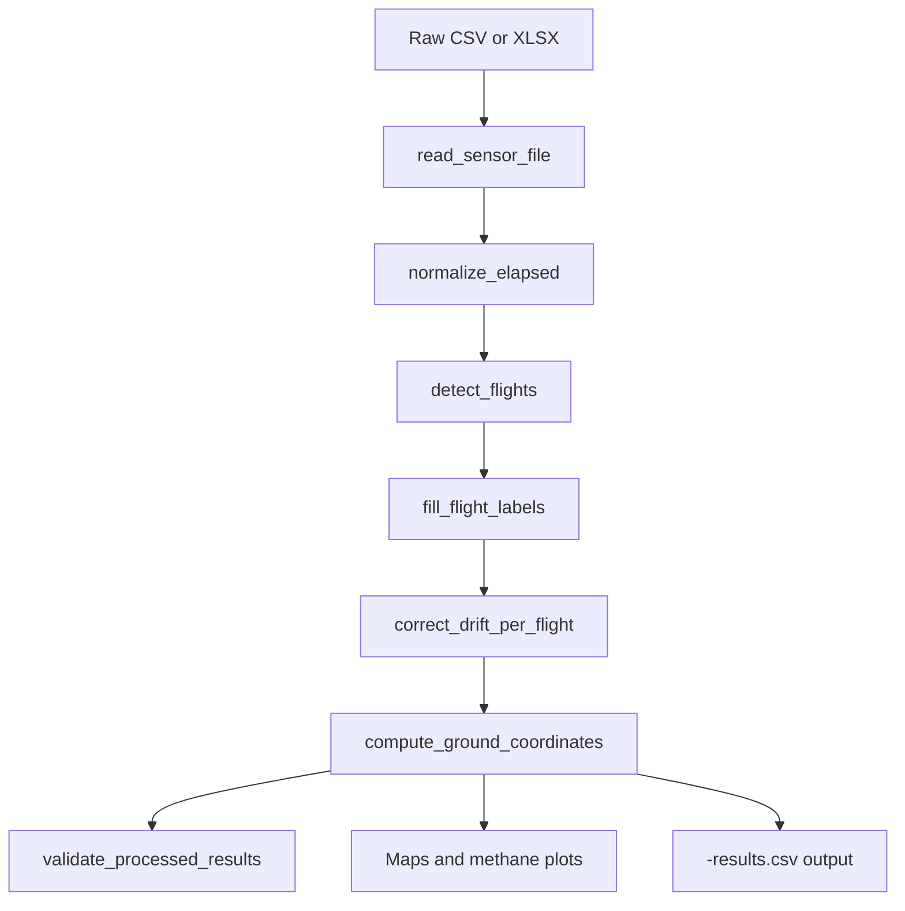

# Pergam Data Processing

This site documents the Pergam methane-processing workflow implemented in [`PergramV2.ipynb`](https://github.com/gus-p-williams/PergamDataProcessing/blob/main/PergramV2.ipynb). The notebook reads Pergam drone sensor files, detects the airborne interval, corrects GPS drift, computes laser ground-intersection coordinates, validates the results, and generates quick methane visualizations.

!!! note
    The checked-in files under `data/3_13_2026_Vernal_Cooked/` are example datasets only. Most users will run this notebook against their own files.

!!! warning
    The checked-in `*-results.csv` files should not be treated as canonical documentation examples unless they have been regenerated from the current notebook version.

## What This Project Does

- Reads both CSV and XLSX Pergam sensor exports.
- Rebuilds elapsed time when CSV `Elapsed` values have been collapsed by Excel export.
- Detects the in-flight portion of each file using positive GPS altitude with hysteresis.
- Propagates segment labels within each flight.
- Corrects latitude, longitude, and altitude drift per flight.
- Projects the laser beam to the ground using pitch, roll, heading, and LIDAR range.
- Emits validation summaries and methane plots for quick review.

## Documentation Map

- Start with [Getting Started](getting-started.md) if you want to run the notebook.
- Read [Data Model](data-model.md) to understand the raw and processed columns.
- Read [Pipeline Overview](pipeline-overview.md) for the end-to-end logic.
- Use [Tutorials](tutorials/run-example-dataset.md) for worked examples.
- Use [Technical Reference](reference/functions.md) for function-level behavior.

## Workflow Diagram

