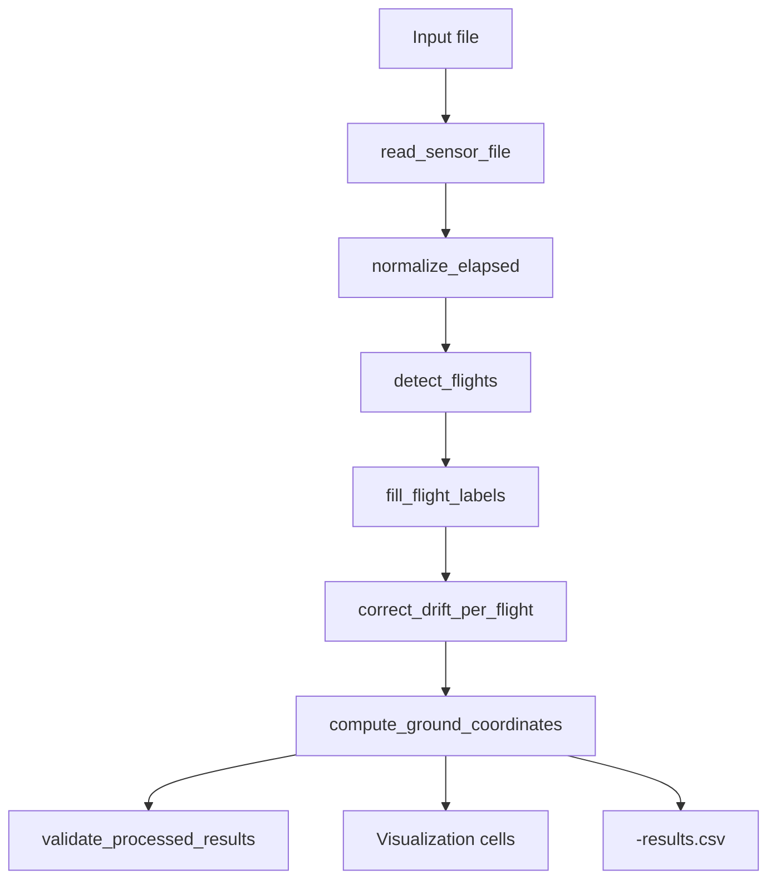

# Pipeline Overview

This page explains the end-to-end processing sequence in `PergramV2.ipynb`.

## Processing Stages

## Stage 1: Read and Standardize Input

Function: `read_sensor_file()`

- detect CSV vs XLSX
- normalize the first label column to `Names of Flights`
- attach metadata such as source extension and session description
- drop `ALT:ID` from CSV processing outputs

## Stage 2: Normalize Time

Function: `normalize_elapsed()`

- preserve `Elapsed` when it is already valid
- rebuild it from `Time` when CSV export has destroyed precision
- produce a monotonic time axis for drift interpolation

## Stage 3: Detect Flights

Function: `detect_flights()`

- smooth GPS altitude
- detect takeoff after a sustained run above threshold
- detect landing after a sustained run below threshold
- return half-open intervals `(start_row, end_row)`

## Stage 4: Propagate Segment Labels

Function: `fill_flight_labels()`

- mark on-ground rows as `On Ground`
- forward-fill XLSX segment labels within each flight
- leave CSV unlabeled in-flight rows empty

## Stage 5: Correct GPS Drift

Function: `correct_drift_per_flight()`

- compute 3D start/end drift per flight
- linearly interpolate drift correction over normalized elapsed time
- emit `Latitude_adj`, `Longitude_adj`, and `Altitude_adj`

## Stage 6: Compute Ground Coordinates

Function: `compute_ground_coordinates()`

- combine adjusted drone position, orientation, and LIDAR range
- project the laser beam to the ground plane
- reject blocked, saturated, and invalid-direction rows
- emit `ground_lat`, `ground_lon`, `ground_alt_est`, and `horizontal_offset_m`

## Stage 7: Validate Outputs

Function: `validate_processed_results()`

- expected flight count
- landing boundary correctness
- on-ground ground-coordinate policy
- CSV label policy
