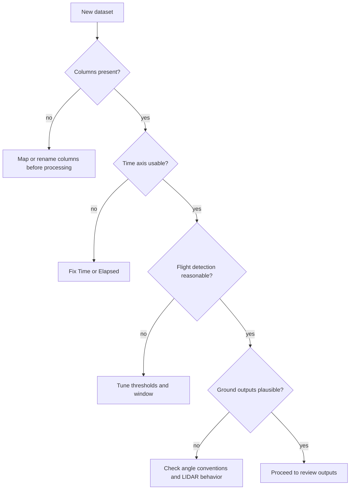

# Tutorial: Bring Your Own Data

This guide is for users who want to run the notebook on their own Pergam-style sensor files.

## Minimum Expectations

Your files should include the columns needed by the pipeline:

- `Time` or a usable `Elapsed`
- `Latitude`
- `Longitude`
- `Altitude`
- `Heading`
- `Pitch`
- `Roll`
- `ALT:Altitude`

## Setup Steps

1. Put your files in one directory.
2. Set `INPUT_DIR` to that directory.
3. Optionally set `OUTPUT_DIR` to a separate results directory.
4. Run the notebook.
5. Review validation output before trusting the derived coordinates.

## What to Tune First

If a new dataset behaves differently, review:

- `TAKEOFF_THRESHOLD_M`
- `LANDING_THRESHOLD_M`
- `ALTITUDE_SMOOTHING_WINDOW`
- `MIN_TAKEOFF_RUN`
- `MIN_LANDING_RUN`

## Suggested Triage Flow

