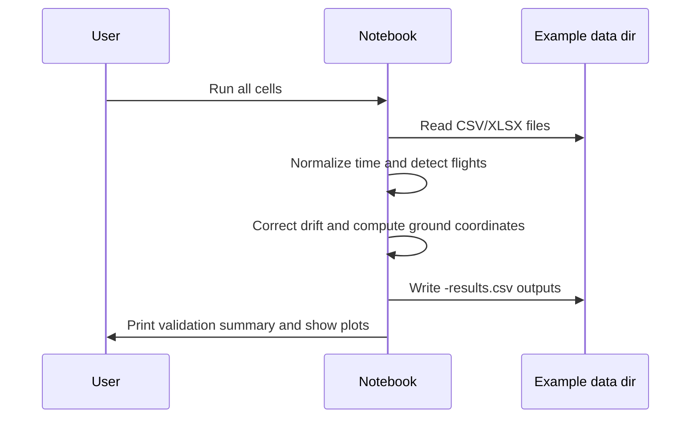

# Tutorial: Run the Example Dataset

!!! note
    This walkthrough uses the example files checked into the repository. Most users will replace these with their own survey files.

## Goal

Run the full notebook pipeline on the example directory and understand the expected outputs.

## Example Input Directory

Default notebook value:

```python
INPUT_DIR = "./data/3_13_2026_Vernal_Cooked"
```

## Steps

1. Open `PergramV2.ipynb`.
2. Leave `INPUT_DIR` unchanged.
3. Leave `OUTPUT_DIR = None`.
4. Run the notebook from top to bottom.
5. Review the processing logs and validation summary.

## Expected Validation Outcomes

For the current example dataset, the notebook should report:

- one detected flight per source file
- correct landing boundaries
- zero on-ground `ground_*` outputs
- correct CSV label behavior

## Example Workflow Figure


